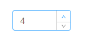

## why use React(Framework)

React确实给我们带来很多便利，但是如果一定要说React（甚至框架）的优点是什么，却似乎有点说不清楚，知其然且知其所以然，才能走得更远。

### 场景

数字选择器



这是一种非常常见的组件，且功能非常单一，从最原始的刀耕火种年代到现代前端开发，感受一下框架到底带来了什么便利，帮我们解决了什么问题。

为了便利，拆分为如下页面，功能类似。


#### version 1

```
<html>
  <body>
    <div class="wrap">
      <button class="add">+</button>
      <button class="subtract">-</button>
      <div class="number">0</div>
    </div>
  </body>
  <script>
    const wrap = document.querySelector('.wrap');
    const addBtn = document.querySelector('.add');
    const subtractBtn = document.querySelector('.subtract');
    const num = document.querySelector('.number');
    
    addBtn.addEventListener('click', function() {
      num.innerHTML = num.innerHTML * 1 + 1;
    }, false);

    subtractBtn.addEventListener('click', function() {
      if (num.innerHTML < 1) return;
      num.innerHTML = num.innerHTML * 1 - 1;
    }, false);
  </script>
</html>
```

注意，这里获取当前值的时候用了读取页面上的值，而没有设置一个跟随变量，是因为，早期的页面，有一种从页面上（或者说从视觉上）获取页面当前状态的习惯，如点击了，加上一个类使目标变色，要提交数据时，根据是否有这个变色类去找这个类。所以这里还原了当时的这种作法。

初始化版本：
```
<script>
    const wrap = document.querySelector('.wrap');
    const addBtn = document.querySelector('.add');
    const subtractBtn = document.querySelector('.subtract');
    const num = document.querySelector('.number');

    let number = 0;
    
    addBtn.addEventListener('click', function() {
      num.innerHTML = ++number;
    }, false);

    subtractBtn.addEventListener('click', function() {
      if (number < 1) return;
      num.innerHTML = --number;
    }, false);
  </script>
```

这里其实已经有点引入数据的意识了，只要数据和视图能够保证同步更新，那么从试图获取数据或当前状态就可以转化为从某个变量获取。

### 场景进化

需求总是不断改变的，任何脱离场景的技术都是假大空。

现在我们这个是一个加减组件了，那必然要考虑到复用。如果我在一个项目的两个页面中使用，该怎么处理？

最简单的方法：copy it。 复制html，复制js。

言多必失，要处理的东西一多也必然会难以维护，项目维护者经过长期迭代后，可能删除了页面上的html，但是留下了js部分，甚至到最后谁都不知道这部分js是做什么的，这必然不是我们所希望的。

#### version2
```
<html>
  <body>
    <div class="wrap">
    </div>
  </body>
  <script>
    class Add {
      createWrapper(str) {
        const wrapper = document.createElement('div');
        wrapper.innerHTML = str;
        return wrapper;
      }

      render() {
        const domStr = `
          <button class="add">+</button>
          <button class="subtract">-</button>
          <div class="number">0</div>
        `;

        const wrapper = this.createWrapper(domStr);

        const addBtn = wrapper.querySelector('.add');
        const subtractBtn = wrapper.querySelector('.subtract');
        const num = wrapper.querySelector('.number');

        let number = 0;
    
        addBtn.addEventListener('click', function() {
          num.innerHTML = ++number;
        }, false);

        subtractBtn.addEventListener('click', function() {
          if (number < 1) return;
          num.innerHTML = --number;
        }, false);

        return wrapper;
      }
    }
  </script>
  <script>
    const wrap = document.querySelector('.wrap');
    const add = new Add();
    wrap.appendChild(add.render());
  </script>
</html>
```

上面的代码特意将两部分js分开写，这样，可以把第一部分作为个单独的js组件（即初步的组件概念），而调用时，只要一个挂载点和一个实例即可。

### new question

问题又出现了，随着'组件'的使用，有一天这个组件改变数值后，要显示多个显示，如当数字为2时，要显示2，二，贰，II甚至更多。。。

可以预见，代码里会出现类似结构：

```
...
const addBtn = wrapper.querySelector('.add');
const subtractBtn = wrapper.querySelector('.subtract');
const num = wrapper.querySelector('.number');
const c_num = wrapper.querySelector('c_number);
const a_num = wrapper.querySelector('a_number');
// maybe more

let number = 0;

addBtn.addEventListener('click', function() {
  num.innerHTML = ++number;
  c_num.innerHTML = C_MAP[++number];
  a_num.innerHTML = A_MAP[++number];
  // maybe more
}, false);
...
```

这不是我们希望看到的，一方面是dom操作的开销，另一方面是变的臃肿，当要新增一个（哪怕是完全一样的显示），或者移除一个，都是不可维护的。

### 数据驱动

更好的做法就是`数据是什么，我就展示什么`，而不是`根据我展示的，去得到数据是什么`。

其实在version1的改进版本里，已经有这个影子了。

这也是数据驱动的原型，差的只是当数据改变时，页面的改变。

先来个简单粗暴的，当数据改变时，页面全部改变，即组件重新渲染。

### version3
```
<html>
  <body>
    <div class="wrap">
    </div>
  </body>
  <script>
    class Add {
      constructor() {
        this.state = {
          number: 0,
        };
      }

      setState(newState) {
        const oldEle = this.wrapper;
        this.state = {...newState};
        this.wrapper = this.render();

        if(this.update) {
          this.update(oldEle, this.wrapper);
        }
      }

      createWrapper(str) {
        const wrapper = document.createElement('div');
        wrapper.innerHTML = str;
        return wrapper;
      }

      handleClickAdd() {
        let newNumber = ++this.state.number;
        this.setState({ number: newNumber });
      }

      handleClickSubtract() {
        let newNumber = --this.state.number;
        this.setState({ number: newNumber });
      }

      render() {
        const domStr = `
          <button class="add">+</button>
          <button class="subtract">-</button>
          <div class="number">${this.state.number}</div>
        `;

        this.wrapper = this.createWrapper(domStr);

        const addBtn = this.wrapper.querySelector('.add');
        const subtractBtn = this.wrapper.querySelector('.subtract');

        addBtn.addEventListener('click', this.handleClickAdd.bind(this), false);

        subtractBtn.addEventListener('click', this.handleClickSubtract.bind(this), false);

        return this.wrapper;
      }
    }
  </script>
  <script>
    const wrap = document.querySelector('.wrap');
    const add = new Add();
    wrap.appendChild(add.render());
    add.update = (oldEle, newEle) => {
      wrap.insertBefore(newEle, oldEle);
      wrap.removeChild(oldEle);
    }
  </script>
</html>
```

### 场景新需求

稍加思考就会发现，数据改变页面改变这个需求是`硬需求`，所以应该抽象出来。

```
<html>
  <body>
    <div class="wrap">
    </div>
  </body>
  <script>
    class Add {
      constructor() {
        this.state = {
          number: 0,
        };
      }

      setState(newState) {
        const oldEle = this.wrapper;
        this.state = {...newState};
        this.wrapper = this.renderElement();

        if(this.update) {
          this.update(oldEle, this.wrapper);
        }
      }

      createWrapper(str) {
        const wrapper = document.createElement('div');
        wrapper.innerHTML = str;
        return wrapper;
      }

      handleClickAdd() {
        let newNumber = ++this.state.number;
        this.setState({ number: newNumber });
      }

      handleClickSubtract() {
        let newNumber = --this.state.number;
        this.setState({ number: newNumber });
      }

      renderElement() {
        this.wrapper = this.createWrapper(this.render());
        const addBtn = this.wrapper.querySelector('.add');
        const subtractBtn = this.wrapper.querySelector('.subtract');

        addBtn.addEventListener('click', this.handleClickAdd.bind(this), false);

        subtractBtn.addEventListener('click', this.handleClickSubtract.bind(this), false);

        return this.wrapper;
      }

      render() {
        const domStr = `
          <button class="add">+</button>
          <button class="subtract">-</button>
          <div class="number">${this.state.number}</div>
        `;

        return domStr;
      }
    }

    const renderToDOM = (cmp, DOMElement) => {
      DOMElement.appendChild(cmp.renderElement());
      cmp.update = (old, next) => {
        DOMElement.insertBefore(next, old);
        DOMElement.removeChild(old);
      }
    }
  </script>
  <script>
    renderToDOM(new Add, document.querySelector('.wrap'));
  </script>
</html>
```

再做一些分离

```
<script>
    class Add extends Cmp {
      constructor() {
        super();
        this.state = {
          number: 0,
        };
      }

      handleClickAdd() {
        let newNumber = ++this.state.number;
        this.setState({ number: newNumber });
      }

      handleClickSubtract() {
        let newNumber = --this.state.number;
        this.setState({ number: newNumber });
      }

      render() {
        const domStr = `
          <button class="add">+</button>
          <button class="subtract">-</button>
          <div class="number">${this.state.number}</div>
        `;

        return domStr;
      }
    }

    renderToDOM(new Add, document.querySelector('.wrap'));
  </script>
```

这不就是`React`吗（非常非常简易版本）！

### 回顾

再从头理一遍，我们解决了哪些问题：

- 结构分散，又要复制HTML，又要复制JS，不易管理
- 不用使用DOM API去一个个更新元素，只要改变数据源即可（数据驱动），方便扩展
- 复用性更好，封装性也更好，每个组件管理自己的状态
- 最后也是个人认为最重要的，`解决了数据和试图不一致`的问题