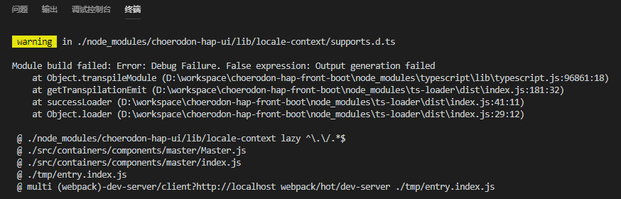

### 按需import带参模块

在Code-Splitting部分有讲到过按需导入组件，有如下三种方式

1. import
2. React.lazy
3. 封装asyncCompoennt

#### 问题描述

为了设置多语言，要先向后端查询当前语言，然后根据当前语言去请求对应的语言包，并且设置该语言包（其实是个普通js对象）。

```javascript
if (currentLang) {
  import(`./lib/locale-context/${currentLang}`)
    .then((o) => {
      localeContext.setLocale(o);
    });
}
```

发现可以正常实现功能，但是webpack会输出一大堆关于ts的警告。



尝试如下方法，输出的警告变成一条了，`Warning: Critical dependencies.`

```javascript
if (currentLang) {
  const uri = `./lib/locale-context/${currentLang}`;
  import(uri)
    .then((o) => {
      localeContext.setLocale(o);
    });
}
```

查询该issue，发现并尝试如下方法，确实不输出警告（但是其实这是非常差的一种方法，原因等会说）

```javascript
if (currentLang) {
  const uri = `./lib/locale-context/${currentLang}`;
  import(`${uri}`)
    .then((o) => {
      localeContext.setLocale(o);
    });
}
```

但是无法正常运行（前面几步虽然有warning，但是功能是正常的）。

最后查阅资料后发现，webpack对于import的打包，有如下规则：

1. import路径必须全部或部分为绝对或相对路径。
2. webpack会把除变量路径，即目标文件所在目录的每个文件（夹）打包成一个chunk，然后调用哪个chunk就拿哪个。
从这可以发现，如果路径指定的不够具体，对性能的影响是非常大的。
3. 如果不指定后缀，会把所有文件名的文件打包。

找到问题了，解决方法如下：
```javascript
if (currentLang) {
  import(`./lib/locale-context/${currentLang}.js`)
    .then((o) => {
      localeContext.setLocale(o);
    });
}
```
加上后缀名即可，完美解决。
