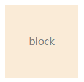
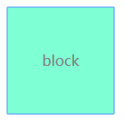
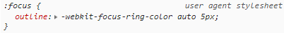
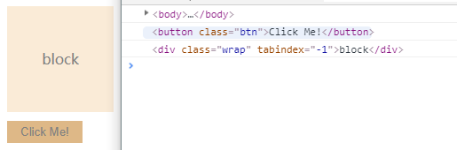

## 焦点和tabIndex

焦点，比较少见的词却是最最常见的现象。少见是因为常见只是focus，autoFocus和blur这些方法或者属性，常见是因为日常王爷使用根本离不开他，比如表单的输入，当我们点击一个input，就发生了焦点变化。

### 谁可以获得焦点？

基本上所有元素都可以获取焦点！

默认情况下，只有表单元素可以获取焦点，因为从设计上来说，只有表单元素是可以交互的。

但是随着页面场景的复杂和多样化，一些惊艳的效果也离开不了焦点事件，如给li元素或者div加上焦点事件。

给元素设置`tabIndex`即可。

```html
<html>
  <head>
    <style>
      .wrap {
        width: 120px;
        height: 120px;
        background: antiquewhite;
        color: grey;
        text-align: center;
        line-height: 120px;
      }
      .wrap:focus {
        background: aquamarine;
      }
    </style>
  </head>
  <body>
    <div class="wrap" tabIndex="-1">block</div>
  </body>
</html>
```

效果如下：

未获得焦点： 

获得焦点：  

从上可以发现，只要给一个元素，加上tabIndex即可让他变成一个可以获取焦点的元素！这会有许多妙用，下文再展开。

### 如何判断某个元素是不是获取焦点了？

最简单的场景，当元素周围有个蓝色的边框时就是获取焦点了。这是因为浏览器对focus有默认样式。



但是这个太视觉性了，有没有更标准一点的呢？

`activeElement`!

可以通过document.activeElement属性来查看当前获取焦点的元素。

```html
<html>
  <head>
    <style>
      .wrap {
        width: 120px;
        height: 120px;
        background: antiquewhite;
        color: grey;
        text-align: center;
        line-height: 120px;
      }
      .wrap:focus {
        background: aquamarine;
      }
      .btn {
        background: burlywood;
        color: grey;
        border:none;
        padding: 5px 15px;
        margin-top: 10px;
      }
    </style>
  </head>
  <body>
    <div class="wrap">block</div>
    <button class="btn">Click Me!</button>
  </body>
  <script>
    function showActiveEle() {
      window.console.log(document.activeElement);
    }
    
    showActiveEle();

    const btn = document.querySelector('.btn');
    const wrap = document.querySelector('.wrap');
    btn.onclick = function() {
      showActiveEle();
      wrap.tabIndex = -1;
      wrap.focus();
      showActiveEle();
    };
  </script>
</html>
```

效果如下：



可以看到，当页面刚加载时，焦点是body，然后点击了button，焦点变为button，当我们给div设置tabIndex和focus后，焦点又变为了wrap。（这里其实出现了一种让元素获得焦点的办法）

### 如何获得焦点？

获得焦点的方法有如下*四种*：

1. 初始态，即页面加载：

从上面的例子可以看出来，当页面加载完成后，焦点为body，那没加载完成时呢？这时为null

2. 用户输出，可能是点击，可能是键盘：

当用户点击某个可被获取焦点的元素，该元素获得焦点；当用户通过tab键移动焦点时，tabIndex就发挥了他的作用。

- tabIndex = -1, tab跳过该元素，但是可以通过鼠标点击获取焦点，也是tabIndex的默认值

- tabIndex = 0, tab键遍历当前元素

- tabIndex > 0, 表示tab键遍历的优先级，值越小优先级越高

3. js控制，focus()

从上面的例子也可以看出，可以通过focus()方法使可获取焦点的元素

4. html属性，autofocus

HTML5新增的表单字段autofocus属性，但是只作用于表单元素！

### 失去焦点

失去焦点有两种方法：

1. 用户操作，点击其他地方

当用户点击非目标元素时，目标元素会失去焦点，在React中，常常也会有click out side来处理类似的情况

2. js方法，blur()

blur()方法可以将焦点从元素中一走，但是并不会把焦点移动到某个特定元素上。

## tabIndex

tabIndex的作用已经在上面说了，mdn上有一句话更准确地说明了他的一些使用场景：

> tabindex=负值 (通常是tabindex=“-1”)，表示元素是可聚焦的，但是不能通过键盘导航来访问到该元素，用JS做页面小组件内部键盘导航的时候非常有用。

当开发React组件时，往往要考虑到用户的键盘输入，这就是所谓的*Accessibility*，而tabIndex可以帮助我们更好地处理键盘事件。

#### 应用tabIndex的方法

```javascript
// 找到第一个可以获取焦点的元素
export function findFirstFocusableElement(node?: HTMLElement): HTMLElement | undefined {
  if (node && node.children) {
    for (const child of node.children as HTMLCollectionOf<HTMLElement>) {
      if (child.tabIndex > -1) {
        return child;
      } else {
        return findFirstFocusableElement(child);
      }
    }
  }
}
```