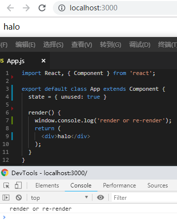
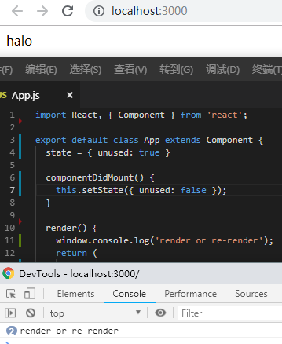
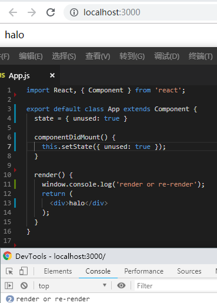
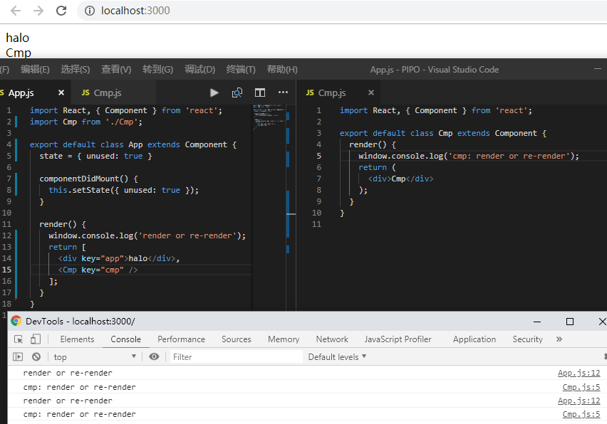

## 记录一次渲染的优化

在使用`react-router`的缓存情况下，发现每次切换tab页，页面中的组件还是会重新渲染，但是从观察上来看，是记录状态了的（也就是缓存的）。

所以使用PureComponent代替Component，以期减少非必要的渲染，提高性能。

### Step1: 确定是什么造成的渲染

通过给一个展示组件加上`shouldComponentUpdate`，对nextProp和props的比较，进行输出。

### Step2: 手动判断是否渲染情况

通过在`shouldComponentUpdate`中浅判断`isEqual`（Lodash）来返回

```javascript
shouldComponentUpdate(nextProps, nextState) {
  return !isEqual(nextProps, this.props);
}
```

但是不能每个业务组件都让程序员加上这个判断，能不能在外面再包一层呢？

考虑到component其实是`Routr`中的component参数返回的，而我们推荐用asyncRouter(() => import(uri))的方式来引入，因为这是一个按需加载的组件，所以我们可以在asyncRouter这一层再包一层。

代码非常简单：

```javascript
// AsyncCmpWrap.jsx
import React, { Component } from 'react';
import isEqual from 'lodash/isEqual';

export default class AsyncModuleWrapper extends Component {
  passProp = this.props;

  shouldComponentUpdate(nextProps, nextState) {
    const shouldUpdate = !isEqual(nextProps, this.props);
    this.passProp = !shouldUpdate ? this.props : nextProps;
    return shouldUpdate;
  }

  render() {
    return this.props.children(this.passProp);
  }
}
```

```javascript
// asyncRouter.jsx

renderChild = (prop) => {
  const { Cmp } = this.state;
  return <Cmp {...prop} />;
}

render() {
  const { Cmp, injects } = this.state;
  const p = { ...Object.assign({}, extProps, this.props, ...injects) };

  return Cmp && (
    <AsyncCmpWrap {...p}>
      {this.renderChild}
    </AsyncCmpWrap>
  );

  // return Cmp && <Cmp {...Object.assign({}, extProps, this.props, ...injects)} />;
}
```

注意！

上面的形式看起来，理所当然，但是第一个版本是这样的

```javascript
render() {
  const { Cmp, injects } = this.state;
  const p = { ...Object.assign({}, extProps, this.props, ...injects) };

  return Cmp && (
    <AsyncCmpWrap {...p}>
      {(prop) => (<Cmp {...prop} />)}
    </AsyncCmpWrap>
  );

  // return Cmp && <Cmp {...Object.assign({}, extProps, this.props, ...injects)} />;
}
```

发现每次都刷新了，即wrap里的shouldComponentUpdate每次都返回true，这是为什么呢？网上有很多组件也是这样写的啊。

因为props.children是个不同的函数，所以后来加到类中编译。

12月23日补充：

重看官网，发现这种场景应该是比较典型的场景问题了。

[链接](https://reactjs.org/docs/render-props.html#caveats)

## 那么问题来了，react的渲染到底受到哪些因素影响呢？

什么情况下会触发re-render，大家可能都能说上来，state和props发生改变时。

再深究一点，props发生改变时是指什么的变化，props本身？或者是props中的每个属性的变化？

怎么阻止re-render？阻止了以后子组件还会不会re-render？

PureComponent又是应对什么场景出现的？解决了什么问题？有什么弊端？

### state改变触发



state变化时，会触发渲染，这时有下面几个注意点：

1. 哪怕改变一个并没有被使用的state中的值，也会触发render！

因为state的变化是Immutable的，这也是我们通过setState修改state而不是直接修改state这个对象的原因，所以每次state发生改变，state整个对象都发生改变了（引用改变了），哪怕其中的内容是一样的。



2. 哪怕重新定义state中的一个值（并没有改变），也会触发render！



2. state触发的渲染，会直接导致所有的子组件渲染！



#### 总之，state变化会触发组件本身和子组件的重新渲染!

## 另

我们知道state改变和props改变会触发渲染，那么这两个都没变是不是就一定不会触发渲染呢？

不是的！

还是上面的例子，我们从子组件的角度来看，子组件的state没变（事实上他并没有state，但是我们可以设置一个），props也没变（事实上也没有。。但是我们也可以设置一个），当我们的unused改变时，子组件也触发了重复渲染，所以看看上面的这句话，聪明的你已经有了更深刻的认识。

### props改变触发

这也是大部分不好定位的地方！因为state的变化，是比较明显的，如果不是state的变化，那大部分情况就是props造成的！