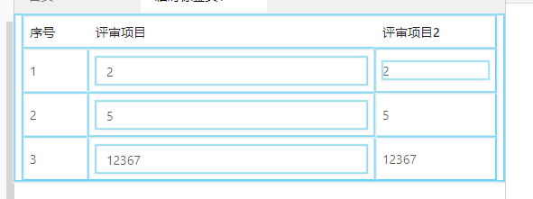

## React Hooks(待补充)

React Hooks 要解决的问题是状态共享（其实更合理地说是状态逻辑的共享或者复用）

主要是指，相同的逻辑代码段，如鼠标事件的处理出现在两个组件中时，就可以把处理鼠标事件的逻辑提取成一个组件。又比如抽离样式获取和纯展示组件的逻辑。

在React Hooks之前，主要通过[render-props](https://reactjs.org/docs/render-props.html) 和 [higher-order components](https://reactjs.org/docs/higher-order-components.html) 两种方案。

## render-props

### 参考阅读

先把最推荐阅读的链接贴上：

[React官方文档中的render-props](https://reactjs.org/docs/render-props.html)

### 定义

里面有一句话，表达地非常贴切：

> a render prop is a function prop that a component uses to know what to render.

render prop一种告诉组件如何render的函数prop。（告诉组件如何渲染即可，没有必须的格式要求）

### 形式

- 带render属性的

```js
<DataProvider render={data => (
  <h1>Hello {data.target}</h1>
)}/>
```

- props形式

```js
<DataProvider> 
  {data => <h1>Hello {data.target}</h1>}
</DataProvider>
```

以第二种更为常见。

### 注意点

1. 如官方文档中[Caveats](https://reactjs.org/docs/render-props.html#caveats)中所列的第一点

与PureComponent的结合使用时要特别注意。

```js
<Mouse render={mouse => (
  <Cat mouse={mouse} />
)}/>
```

如果Mouse组件，是一个PureComponent，由于render每次都会传递不同的函数引用，所以Mouse组件会重新渲染。

解决方法就是把render函数提取为一个实例方法。

（具体为啥可以这样解决，可以查看编译后的两种函数的声明方式来对比了解）


*实际例子*

为了达到页面缓存的效果，发现页面每次都会刷新

```js
// asyncRouter.js
render() {
  const { Cmp, injects } = this.state;
  const p = { ...Object.assign({}, extProps, this.props, ...injects) };

  return Cmp && (
    <AsyncCmpWrap>
      {p => <Cmp {...p} />}
    </AsyncCmpWrap>
  );
}
```

```js
// AsyncCmpWrap.js
shouldComponentUpdate(nextProps, nextState) {
  const shouldUpdate = !isEqual(nextProps, this.props);
  this.passProp = !shouldUpdate ? this.props : nextProps;
  return shouldUpdate;
}

render() {
  return this.props.children(this.passProp);
}
```

不能使用的原因和上述类似，因为箭头函数每次都会传递新的函数过去

改为如下即可：

```js
// asyncRouter.js
renderChild = (prop) => {
  const { Cmp } = this.state;
  return <Cmp {...prop} />;
}

render() {
  const { Cmp, injects } = this.state;
  const p = { ...Object.assign({}, extProps, this.props, ...injects) };

  return Cmp && (
    <AsyncCmpWrap {...p}>
      {this.renderChild}
    </AsyncCmpWrap>
  );
}
```

当时这个问题还有专门的记录[传送门](https://github.com/HuangQiii/Daily/blob/master/1220-render/1220-render.md)

2. 与Mobx结合使用时，改变了数据却不渲染

bug来自于同事的一个实际场景，他抽离了一个Provider组件，大体如下

```js
import Store from './store';

// @observer

<Provider>
  {({ id, name }) => (
    <Card
      name={name}
      clicked={Store.getCurrentClickedCardId === id}
    />
  )}
</Provider>
```

发现点击卡片后，改变了Store的currentClickedCardId，而卡片并没有变色，而当前组件和Card组件是可观测的。

问题就在Provider组件上，因为Provider组件本身是不可观察的，而render-props的本质是在Provider组件内进行render，也就是说，此时的上下文是Provider组件！而不是引用Provider的组件。

对Provider组件来说，state和props都没有改变，不会更新。

## React的渲染逻辑

既然上面提到了React的渲染逻辑，就来整理一下这部分。

首先来确定一下，如何判断一个组件是不是发生了渲染或者重渲染（rerender）。

1. console法

在组件的render函数中，打印输出，每当函数发生（重）渲染，就会在控制台输出一条。

2. 使用React插件的Preferences中的Highlight Updates

当组件渲染时，会有高亮，如下图：



什么情况下会触发re-render，大家可能都能说上来，state和props发生改变时。

而其中的注意点和一些事例代码非常多，参加[另一篇总结](https://github.com/HuangQiii/Daily/blob/master/1220-render/1220-render.md#%E9%82%A3%E4%B9%88%E9%97%AE%E9%A2%98%E6%9D%A5%E4%BA%86react%E7%9A%84%E6%B8%B2%E6%9F%93%E5%88%B0%E5%BA%95%E5%8F%97%E5%88%B0%E5%93%AA%E4%BA%9B%E5%9B%A0%E7%B4%A0%E5%BD%B1%E5%93%8D%E5%91%A2)