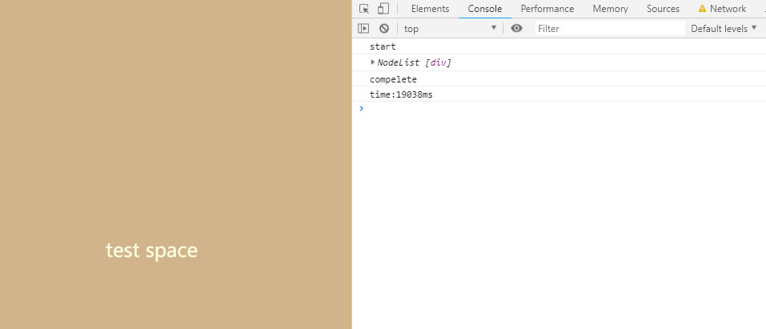

## css加载阻塞js执行

*注意调慢网络速度，但是不能断网！*

```html
<html>
  <head>
    <style>
      body {
        background: tan !important;
        display: flex;
        justify-content: center;
        align-items: center;
      }
      body div {
        color: lightyellow;
        font-size: 24px;
      }
    </style>
    <script>
      console.log('start')
      const startDate = new Date();
    </script>
    <link href="https://cdn.bootcss.com/bootstrap/4.0.0-alpha.6/css/bootstrap.css" rel="stylesheet">
    <script>
      const endDate = new Date()
      console.log('compelete')
      console.log('time:' + (endDate -startDate) + 'ms')
    </script>
  </head>
  <body>
    <div>test space</div>
  </body>
</html>
```

最后结果如下，


可以得出结论，`css的加载会阻塞下面的js的执行`。

再深入一点，这样呢

```html
<html>
  <head>
    <style>
      body {
        background: tan !important;
        display: flex;
        justify-content: center;
        align-items: center;
      }
      body div {
        color: lightyellow;
        font-size: 24px;
      }
    </style>
    <script>
      function fun() {
        const h = document.querySelectorAll('div');
        console.log(h);
      }
      setTimeout(fun, 0)
    </script>
    <script>
      console.log('start')
      const startDate = new Date();
    </script>
    <link href="https://cdn.bootcss.com/bootstrap/4.0.0-alpha.6/css/bootstrap.css" rel="stylesheet">
    <script>
      const endDate = new Date()
      console.log('compelete')
      console.log('time:' + (endDate -startDate) + 'ms')
    </script>
  </head>
  <body>
    <div>test space</div>
  </body>
</html>

```


惊奇地发现，如果css后面有js，css阻塞了js，而js会阻塞dom树的构建！所以变相的可以说，css甚至`间接阻塞`了dom树的构建？

不对，这好像和以前接收到的知识不符，那再做个例子

```html
<html>
  <head>
    <style>
      body {
        background: tan !important;
        display: flex;
        justify-content: center;
        align-items: center;
      }
      body div {
        color: lightyellow;
        font-size: 24px;
      }
    </style>
    <script>
      function fun() {
        const h = document.querySelectorAll('div');
        console.log(h);
      }
      setTimeout(fun, 0)
    </script>
    <script>
      console.log('start')
      const startDate = new Date();
    </script>
    <link href="https://cdn.bootcss.com/bootstrap/4.0.0-alpha.6/css/bootstrap.css" rel="stylesheet">
  </head>
  <body>
    <div>test space</div>
  </body>
</html>
```


虽然渲染还是很慢，但是dom树构建是完成了！

最后一个例子：

```html
<html>
  <head>
    <style>
      body {
        background: tan !important;
        display: flex;
        justify-content: center;
        align-items: center;
      }
      body div {
        color: lightyellow;
        font-size: 24px;
      }
    </style>
    <script>
      function fun() {
        const h = document.querySelectorAll('div');
        console.log(h);
      }
      setTimeout(fun, 0)
    </script>
    <script>
      console.log('start')
      const startDate = new Date();
    </script>
    <link href="https://cdn.bootcss.com/bootstrap/4.0.0-alpha.6/css/bootstrap.css" rel="stylesheet">
  </head>
  <body>
    <div>test space</div>
    <script>
      const endDate = new Date()
      console.log('compelete')
      console.log('time:' + (endDate -startDate) + 'ms')
    </script>
  </body>
</html>
```



这下又符合‘常规’的认知了！