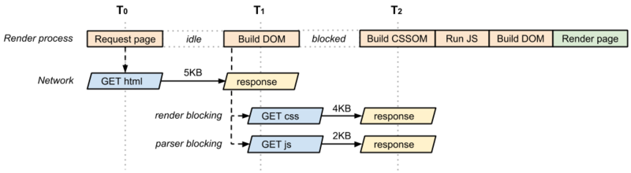
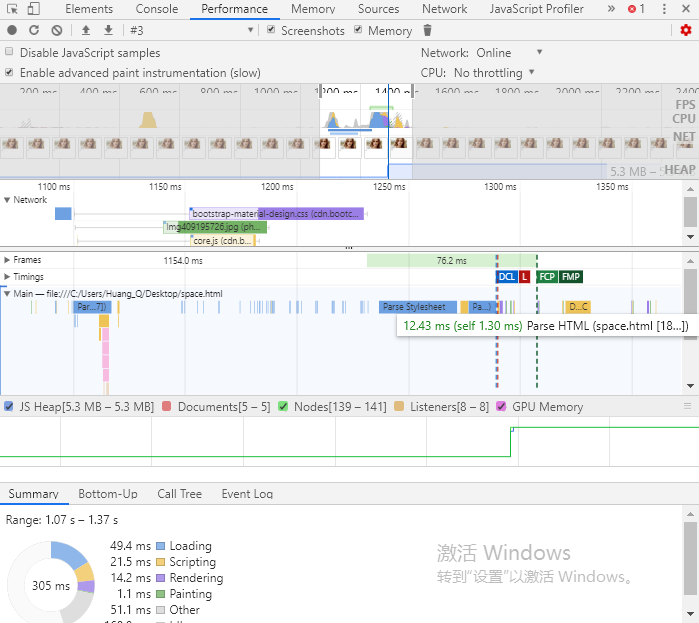

## 关于加载对DOM构建的影响

在[web性能优化](https://github.com/HuangQiii/Daily/blob/master/320/web%E6%80%A7%E8%83%BD%E4%BC%98%E5%8C%96.md#%E6%80%8E%E4%B9%88%E8%A7%82%E5%AF%9Fcrp)中分析到了怎么观察CRP，但是回过头来一想似乎和值钱[css加载阻塞js执行](https://github.com/HuangQiii/Daily/blob/master/312-%E3%80%90%E6%96%B9%E6%B3%95%E3%80%91%E5%A6%82%E4%BD%95%E5%AE%9E%E8%B7%B5css%E9%98%BB%E5%A1%9E%E6%B8%B2%E6%9F%93/css%E9%98%BB%E5%A1%9Ejs%E6%89%A7%E8%A1%8C.md)系列的结论略有出入。

前者有如下的结论图：



当时分析认为DOM的渲染（Build DOM）被Build CSSOM阻塞（blocked）了。

但是后文分析时，css的加载是不会阻塞DOM树的构建的，更别说CSSOM的构建时了（在加载前基本就构建完毕了）。

所以做了如下几个例子：

### 只加载一个远程的CSS

```html
<!DOCTYPE html>
<html lang="en">
<head>
  <meta charset="UTF-8">
  <meta name="viewport" content="width=device-width, initial-scale=1.0">
  <link rel="stylesheet" href="https://cdn.bootcss.com/bootstrap-material-design/4.0.2/bootstrap-material-design.css">
  
  <title>Test</title>
</head>
<body>
  <div>
    <figure>
      
      <figcaption>Emma.Watson</figcaption>
    </figure>
    <button id="switch">Switch</button>
  </div>
</body>
</html>
```

结果如下：


可以发现，只有一段Parse HTML阶段（蓝色的），后面的是CSS相关的处理，然后就到FCP了，所以DOM解析阶段在CSS加载之前就完成了（从上面的network可以分析得到css文件请求前dom应该已经构建完成了）。

### 只运行一个本地的js

```html
<!DOCTYPE html>
<html lang="en">
<head>
  <meta charset="UTF-8">
  <meta name="viewport" content="width=device-width, initial-scale=1.0">
  <title>Test</title>
</head>
<body>
  <div>
    <figure>
      
      <figcaption>Emma.Watson</figcaption>
    </figure>
    <button id="switch">Switch</button>
  </div>
  <script src="./index.js"></script>
</body>
</html>
```

```js
console.log('halo');
```

结果如下：


可以发现，在js执行完后，又触发了一段Parse HTML，可以理解为，js执行重新触发了DOM的构建（可能不严谨，有错误今后修改）。

### 加载远程css和远程js，且css先加载完毕

```html
<!DOCTYPE html>
<html lang="en">
<head>
  <meta charset="UTF-8">
  <meta name="viewport" content="width=device-width, initial-scale=1.0">
  <link rel="stylesheet" href="https://cdn.bootcss.com/twitter-bootstrap/4.3.1/css/bootstrap-grid.css">
  
  <title>Test</title>
</head>
<body>
  <div>
    <figure>
      
      <figcaption>Emma.Watson</figcaption>
    </figure>
    <button id="switch">Switch</button>
  </div>
  <script src="https://cdn.bootcss.com/jquery/3.3.1/jquery.js"></script>
</body>
</html>
```

结果如下：


当css返回时，js还没加载完，但是FCP就触发了，说明此时DOM树已经构建完毕，并且CSSOM也构建完毕合成了render tree。所以这也间接证明了上文的一些结论。

而当js加载完成后，出发了js的Evaluate Script，然后又出发了Parse HTML！说明js的执行确实会重新构建（至少修改或者重新构建部分）DOM树。


### 加载远程css和远程js，且js先加载完毕

```html
<!DOCTYPE html>
<html lang="en">
<head>
  <meta charset="UTF-8">
  <meta name="viewport" content="width=device-width, initial-scale=1.0">
  <link rel="stylesheet" href="https://cdn.bootcss.com/bootstrap-material-design/4.0.2/bootstrap-material-design.css">
  
  <title>Test</title>
</head>
<body>
  <div>
    <figure>
      
      <figcaption>Emma.Watson</figcaption>
    </figure>
    <button id="switch">Switch</button>
  </div>
  <script src="https://cdn.bootcss.com/jquery/3.3.1/core.js"></script>
</body>
</html>
```

结果如下：



可以发现，js加载完后并没有马上执行，而是等css加载执行完后才执行，然后又触发了Parse DOM，这和前文的场景相符。

### 结论

至此，一些加载的阻塞关系，执行顺序，CRP相关内容和FCP的触发时间，以及FCP包含的具体含义就更加清楚了。