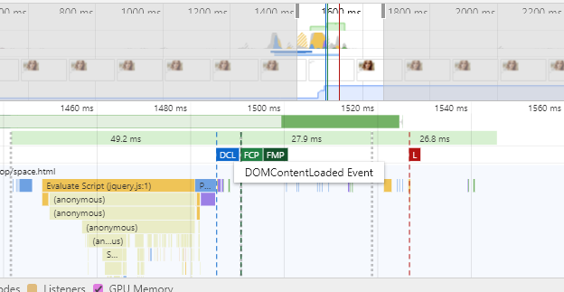
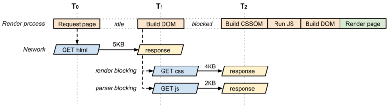
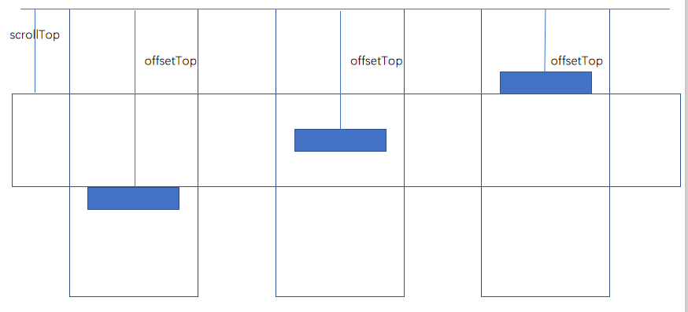
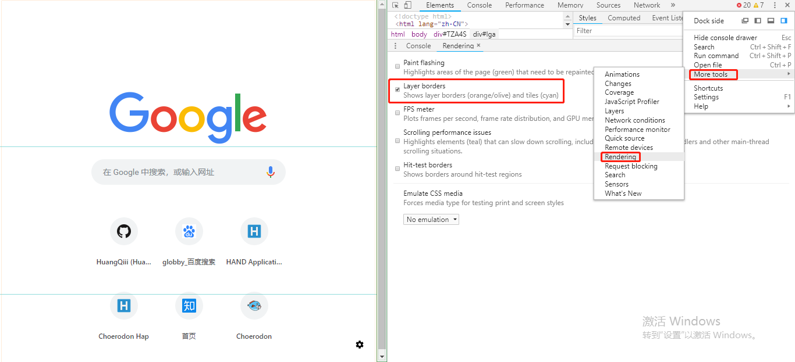
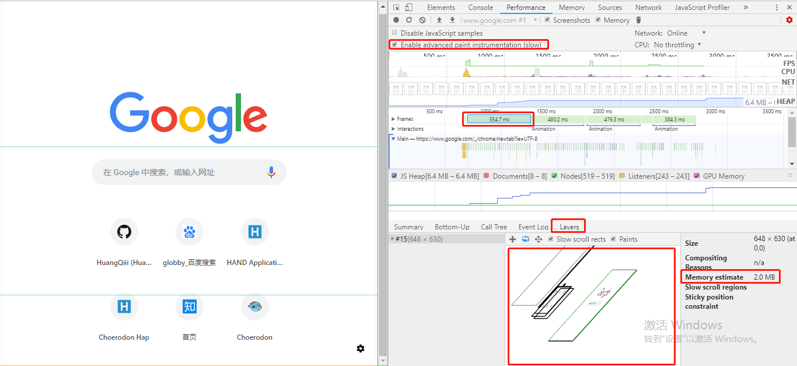

## web性能优化

开个大坑，性能优化有很多“军规”，但是很多都是流于表面（对我来说，知道这样可以优化，但是用到项目里具体怎么用，怎么看效果却知之甚少）。

不过这篇文章还是不打算讲怎么用！更多的是讲一些使用场景和怎么观察效果。单纯是为了记录看到的不熟悉的一些技术和术语。

> Web 性能除了通用编程最佳实践之外，你应该期望访问者查看你的代码或设计及其性能影响。它曾经足以将 CSS 置于文档的顶部，而 JS 脚本位于页面底部，但 Web 正在快速移动，你应该熟悉这个领域的复杂性。

- 关键渲染路径；
- Service Worker；
- 图像优化；
- 延迟加载和捆绑拆分；
- HTTP/2 和服务器推送的一般含义；
- 何时预取和预加载资源；
- 减少浏览器回流以及何时将元素提升到 GPU；
- 浏览器布局、组合和绘制之间的区别

*由于本篇涉及的内容很多，所以参考链接放在每个章节内部*

[Web 性能](https://www.zhihu.com/question/41466747/answer/584673304)

### 关键渲染路径

#### 参考阅读

- [以通俗的方式理解关键渲染路径](https://segmentfault.com/a/1190000008984446#articleHeader3)
- [Critical Rendering Path ](https://developers.google.com/web/fundamentals/performance/critical-rendering-path/)

由于很多基础概念和细节在一些文章中讲的甚是详细，下面就以面试的表达形式来说。

#### 什么是关键渲染路径

关键渲染路径（CRP)就是浏览器从开始请求到首次渲染内容到屏幕上所作的事。其中可以拆分理解为关键+渲染路径，关键就是强调首屏渲染的概念。

CRP包括本地加载渲染和网络请求两部分。

CRP包括几个关键的时间点：

- domLoading：CRP起点
- domInteractive：DOM树构建完毕
- domContentLoaded： DOM树构建完毕且没有任何样式阻塞脚本运行
- domCompelete：全部完成，包括图片字体等

#### *怎么观察CRP*

```html
<!DOCTYPE html>
<html lang="en">
<head>
  <meta charset="UTF-8">
  <meta name="viewport" content="width=device-width, initial-scale=1.0">
  <link rel="stylesheet" href="https://cdn.bootcss.com/twitter-bootstrap/4.3.1/css/bootstrap-grid.css">
  
  <title>Test</title>
</head>
<body>
  <div>
    <figure>
      
      <figcaption>Emma.Watson</figcaption>
    </figure>
    <button id="switch">Switch</button>
  </div>
  <script src="https://cdn.bootcss.com/jquery/3.3.1/jquery.js"></script>
</body>
</html>
```

使用的全是网络链接和CDN，不需要改动，直接复制过去在浏览器中打开，点开DevTools中的Performance，刷新页面，会得到如下的图



其中蓝线表示DOMContentLoaded，红线表示onload。

大体过程如下：



其中DOM树的解析会被JS给阻塞这是大家都知道的，而CSS的加载也会阻塞JS的执行，所以当CSS和JS请求和执行时，DOM的构建会被阻塞。

#### 优化CRP就是尽快使DOMContentLoaded发生

因为DOMContentLoaded了之后，就会开始触发FCP和FMP，图一中的绿色，表示有内容出来了。其实更详细地说，就是RenderTree开始构建了。

所以有如下几个比较实用的方法：

1. 减少脚本数量：因为每次脚本请求，浏览器都会等待响应，更不用说脚本的解析
2. 把JS放在HTML最后，使用async属性，这会告诉浏览器不阻塞这里继续构建DOM。`注意：`使用defer，在浏览器中是先触发defer再触发DOMContentLoaded的，所以从我的理解来看，对优化CRP没有帮助
3. 将样式放在head内尽可能早地加载，除非是没有js的页面（基本不存在）

其实这样看下来，这些建议也就是一些所谓的”金科玉律“，但是这样反着看上去，似乎一切都变的更加详细清晰了。

### 延迟加载

#### 参考阅读

- [原生JS实现最简单的图片懒加载](https://segmentfault.com/a/1190000010744417?utm_source=tag-newest)
- [IntersectionObserver API 使用教程](http://www.ruanyifeng.com/blog/2016/11/intersectionobserver_api.html)

#### 延迟加载的意义

其实说的宽泛一点，延迟加载本身也是上面优化CRP的一种形式，把重要的影响首屏的内容尽快加载，其他不重要的可以”延迟“一点。

#### 传统延迟加载

一般是根据是否出现在可视区内进行提前加载，常见于长列表图片。

实现方式主要有两种：

1. 监听scroll事件进行判断是不是快要到屏幕内了
2. 使用IntersectionObserver API

##### scroll事件

scroll方法比较原始也比较广泛，主要做法是监听scroll事件，当到某种情况时进行事件处理，一般是处理scrollTop，offsetTop和clientHeight和height之间的关系。



由一和三可得当offsetTop <= scrollTop + clientHeight时和offsetTop + height >= scrollTop时是可见的。

不再赘述，一搜一大堆。

另一种方法是使用getBoundingClientRect()：


由于top，left等是相对于浏览器左上角的，所以可以由top和clientHeight进行对比判断是否在可视区内，top <= clientHeight就是在。

```js
function isInSight(el) {
  const bound = el.getBoundingClientRect();
  const clientHeight = window.innerHeight;
  return bound.top <= clientHeight;
}
```

####IntersectionObserver API

上面两种方法都是要监听scroll事件，既然说到scroll事件就肯定要做一些防抖操作，来看另一种更适合的方法。

IntersectionObserver API可以自动"观察"元素是否可见。

具体的api不在此赘述，详看[此](http://www.ruanyifeng.com/blog/2016/11/intersectionobserver_api.html)

以滚动图片延迟加载为例：

```js
const io = new IntersectionObserver(ioes => {
  ioes.forEach(ioe => {
    const { intersectionRatio } = ioe;
    if (inteintersectionRatior <= 0) return;
    const { target: { el }} = ioe;
    loadImg(el);
    el.onload = el.onerror = () => io.unobserve(el);
  });
});

function observeImgs() {
  const imgs = Array.from(document.querySelectorAll(".img"));
  imgs.forEach(item => io.observe(item));
}

observeImgs();
```

#### 在React中的体现

在React中，延迟加载可以说是无处不在了，而且更贴近”要用了再去加载“的概念，比如webpack打包后把chunk进行分包，再比如动态import，亦或者react-router的路由”按需加载“，体现的都是这个思想。

- [dynamic react component](https://github.com/HuangQiii/Daily/blob/master/928-reactDyCmp/928-reactDyCmp.md)
- [按需import带参模块](https://github.com/HuangQiii/Daily/blob/master/1115-dyimport/1115-dyimport.md)
- [Code-Splitting](https://reactjs.org/docs/code-splitting.html)

### 预加载

### 将元素提升至GPU

GPU加速涉及的基础在浏览器基础的文章里有描述到，就是栅格化和合成层，这里主要展示一下怎么观察和优化。

#### 参考阅读

- [GPU加速是什么](https://blog.csdn.net/phj_88/article/details/80935401)
- [CSS3硬件加速也有坑！！！](https://div.io/topic/1348)

#### 观察



其中会有两种颜色的边框：

1. 黄色边框：有动画 3d 变换的元素，表示放到了一个新的复合层（composited layer）中渲染
2. 蓝色的栅格：这些分块可以看作是比层更低一级的单位，这些区域就是 RenderLayer
打开一个页面

总的来说，黄色的边框越少越好。

#### 怎么看得更具体？



在浏览器上看到的只是一个复印版，即最终只有一个层。最后合并所有可视图层，输出一张图片到屏幕上。但实际上一些dom会因为一些规则被提升成独立的层（开启 GPU 加速），一旦被独立出来之后，便不会再影响其他dom的布局，因为它改变之后，只是“贴上”了页面。

#### 如何开启GPU加速

- 3D 或透视变换(perspective，transform) CSS 属性
- 使用加速视频解码的video元素
- 拥有 3D (WebGL) 上下文或加速的 2D 上下文的 canvas 元素
- 混合插件(如 Flash)
- 对自己的 opacity 做 CSS 动画或使用一个动画 webkit 变换的元素
- 拥有加速 CSS 过滤器的元素
- 元素A有一个 z-index 比自己小的元素B，且元素B是一个合成层（换句话说就是该元素在复合层上面渲染），则元素A会提升为合成层

> 元素B应该在单独的合成层上，并且屏幕的最终图像应该在 GPU 上组成。但是A元素在B元素的顶部，我们没有指定提升A元素自身层级的东西。那么浏览器会做什么？它将强制为元素A创建一个新的合成图层。
这样，A和B都被提升到单独的复合层。
因此，使用 GPU 加速提升动画性能时，最好给当前动画元素增加一个高一点的 z-index 属性，人为干扰复合层的排序，可以有效减少 Chrome 创建不必要的复合层，提升渲染性能。

> GPU 不仅需要发送渲染层图像到 GPU ，而且还需存储它们，以便稍后在动画中重用。别盲目创建渲染层，一定要分析其实际性能表现。因为创建渲染层是有代价的，每创建一个新的渲染层，就意味着新的内存分配和更复杂的层的管理。对于使用移动设备的用户来说是很坑的。移动设备没有台式机那么多的内存。过多的 GPU 加速会引起页面卡顿甚至闪退。
