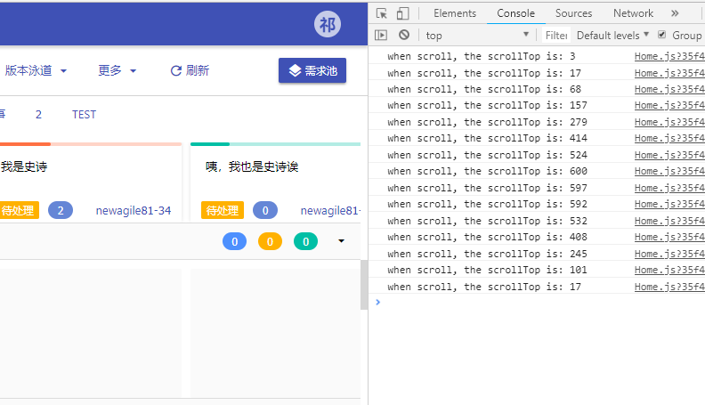
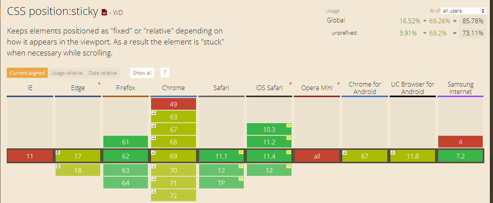
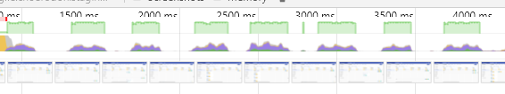

# 故事地图滚动部分实现备忘和思路整理

## 要求样式


## 要求

- 上部史诗头部，不可垂直滚动，可水平滚动（但不出现滚动条）
- 下部面板部分可水平滚动，并有滚动条，当水平滚动时，头部跟随滚动，且标题不动
- 下部面板部分可垂直滚动，且最上标题栏会根据当前位置更新

## 布局实现

这是典型的`表格表头不动，表体可动`布局，先用类似布局方式实现后，着重处理滚动事件。

### 第一版

```
handleScroll = (e) => {
  const { scrollLeft, scrollTop } = e.target;
  this.setState({ left });
  document.getElementById('fixHead-head').scrollLeft = left;
  const lines = document.getElementsByClassName('fixHead-line-title');
  for (let i = 0; i < lines.length; i++) {
    if (lines[i].getBoundingClientRect().top - 350 >= -55) {
      this.setState({ title: lines[i - 1].dataset.title });
      break;
    }
  }
};
```

实测发现，非常卡，通过快照发现，卡顿在setState方法，setState方法本身使用的时间在scroll频繁触发下变的异常夸张。

修改思路：改为store可能可以不那么卡

### 第二版

```
handleScroll = (e) => {
  const { scrollLeft, scrollTop } = e.target;
  const { UserMapStore } = this.props;
  UserMapStore.setLeft(left);
  document.getElementById('fixHead-head').scrollLeft = left;
  const lines = document.getElementsByClassName('fixHead-line-title');
  for (let i = 0; i < lines.length; i++) {
    if (lines[i].getBoundingClientRect().top - 350 >= -55) {
      UserMapStore.setTitle(lines[i - 1].dataset.title)
      break;
    }
  }
}
```

思考：这里不加以方向区分，只要触发了滚动事件，又会写入scrollLeft又会处理scrollTop的操作，但是其实水平和垂直滚动是分开的，能不能区分处理呢？

### 第三版

```
handleScroll = (e) => {
  const { scrollLeft, scrollTop } = e.target;
  const { UserMapStore } = this.props;
  const { left, top } = UserMapStore;
  const header = document.getElementById('fixHead-head');
  if (scrollLeft !== left) {
    UserMapStore.setLeft(scrollLeft);
    header.scrollLeft = scrollLeft;
  }
  if (scrollTop !== top) {
    UserMapStore.setTop(scrollTop);
    const lines = document.getElementsByClassName('fixHead-line-title');
    for (let i = 0; i < lines.length; i++) {
      if (lines[i].getBoundingClientRect().top - 350 >= -55) {
        UserMapStore.setTitle(lines[i - 1].dataset.title)
        break;
      }
    }
  }
};
```

至此，通过一个变量记录上一次的滚动信息，来进行滚动是水平还是垂直区分处理，逻辑更清晰。

`重要转变`

问题：频繁的获取title节点，并且遍历获取title的getBoundingClientRect().top属性，但是其实在滚动情况下，title的距离顶部距离（offsetTop）是不变的，那为何不在一开始把这个值存在一个数组里？这样遍历就是数组遍历了！就在页面加载完后，根据title的offsetTop遍历出一个数组，存在state里，当滚动时，只要判断scrollTop与offsetTop的大小即可。

### 第四版

```
handleScroll = (e) => {
  const { scrollLeft, scrollTop } = e.target;
  const { UserMapStore } = this.props;
  const { left, top } = UserMapStore;
  const header = document.getElementById('fixHead-head');
  if (scrollLeft !== left) {
    UserMapStore.setLeft(scrollLeft);
    header.scrollLeft = scrollLeft;
  }
  if (scrollTop !== top) {
    const { offsetTops, currentIndex } = UserMapStore;
    UserMapStore.setTop(scrollTop);
    window.console.log('when scroll, the scrollTop is: ' + scrollTop);
    const index = _.findLastIndex(offsetTops, v => v < scrollTop);
    if (currentIndex !== index) {
      UserMapStore.setCurrentIndex(index);
    }
  }
};
```

这时候出现了一个问题，通过在处理垂直部分打印出scrollTop发现，当快速滚动到头时，scrollTop不总是0（事实上，很少出现0），这样导致的问题是，用户快速滚动到顶部了，顶部的标题却不是第一块的标题。



打印scrollTop测试，一开始测试发现经常为一个较小的值，所以加入了判断，当scrollTop <= 9时就理解为滚动到头了，修改后又发现如果大幅滚动，这个值可能很大（可能为500多，上图为17），这样这个方法就不能用了。

### 解决

去网上查找了很多资料，发现大家都是遇到scrollTop永远为0而不是不为0，开始想是不是自己写错了，所以写了如下方法测试：

```
handleScroll = (e) => {
  const { scrollLeft, scrollTop } = e.target;
  const { UserMapStore } = this.props;
  const { left, top } = UserMapStore;
  const header = document.getElementById('fixHead-head');
  if (scrollLeft !== left) {
    UserMapStore.setLeft(scrollLeft);
    header.scrollLeft = scrollLeft;
  }
  window.console.log(scrollTop);
};
```

测试发现，不管滚动多快，最后这个值永远为0，那么继续测试

```
handleScroll = (e) => {
  const { scrollLeft, scrollTop } = e.target;
  const { UserMapStore } = this.props;
  const { left, top } = UserMapStore;
  const header = document.getElementById('fixHead-head');
  if (scrollLeft !== left) {
    UserMapStore.setLeft(scrollLeft);
    header.scrollLeft = scrollLeft;
  }
  if (scrollTop !== top) {
    window.console.log(scrollTop);
  }
};
```

这时候却又出现了不为0的情况，那么说明这个if判断是导致问题的关键（~~虽然不知原因~~）。而这里除了垂直就是水平，把if换成else

后来补充：

将上述if中条件换为

- [].length === 0
- true
- scrollTop !== null

 时，皆能正确打印0，可以得出是store中的top中的值的更新时间导致，但下面方案的思路也是正确的，没有必要缓存这个top值到store，因为他并不影响渲染。

```
handleScroll = (e) => {
  const { scrollLeft, scrollTop } = e.target;
  const { UserMapStore } = this.props;
  const { left, top } = UserMapStore;
  const header = document.getElementById('fixHead-head');
  if (scrollLeft !== left) {
    UserMapStore.setLeft(scrollLeft);
    header.scrollLeft = scrollLeft;
  } else {
    window.console.log(scrollTop);
  } 
};
```

发现可行，那么解决了滚动到头部更新标题不及时的问题。这时部分记录值是不必要的了（如store中的top，那本是用来判断是否垂直滚动的，但是这里进入else必然是垂直滚动）

```
handleScroll = (e) => {
  const { scrollLeft, scrollTop } = e.target;
  const { UserMapStore } = this.props;
  const { left, top, offsetTops, currentIndex } = UserMapStore;
  const header = document.getElementById('fixHead-head');
  if (scrollLeft !== left) {
    UserMapStore.setLeft(scrollLeft);
    header.scrollLeft = scrollLeft;
  } else {
    const index = _.findLastIndex(offsetTops, v => v <= scrollTop + 42);
    if (currentIndex !== index && index !== -1) {
      UserMapStore.setCurrentIndex(index);
    }
  }
};
```

`这版就是目前的线上版本`，但是发现在大数据量的情况下，水平滚动还是存在卡顿的情况，一句句测试发现是`UserMapStore.setLeft(scrollLeft);`导致的，推测是触发次数过多导致多次渲染所致，引入防抖机制。

```
let sl;
const header = document.getElementById('fixHead-head');

handleScroll = (e) => {
  const { scrollLeft, scrollTop } = e.target;
  const { UserMapStore } = this.props;
  const { left, offsetTops, currentIndex } = UserMapStore;
  if (scrollLeft !== sl) {
    sl = scrollLeft;
    header.scrollLeft = scrollLeft;
    this.debounceSetLeft(scrollLeft);
  } else {
    const index = _.findLastIndex(offsetTops, v => v <= scrollTop + 42);
    if (currentIndex !== index && index !== -1) {
      UserMapStore.setCurrentIndex(index);
    }
  }
};

debounceSetLeft = _.debounce((left) => {
  const { UserMapStore } = this.props;
  UserMapStore.setLeft(left);
}, 300);
```

这样，只有在滚动停止后的300ms才会设置left，这样，下面的title才会变，滚动效果为原生滚动效果，无卡顿。

但是这个效果不是非常友好，暂时不采用在生产环境。

不过这给了一个继续优化的思路，要不减少渲染卡片的数量（改变store造成重新渲染），要不改变和left相关的布局（即title的变化形式）。

将使用`react-virtualized`渲染屏幕中的卡片来来减少因为改变store造成重新渲染的压力提升速度。

## 9月17日更新

尝试使用`react-virtualized`进行布局（会变成决定定位），由于改动较大，未进行替换。

期间，使用`css value`进行过一版优化，[css value](https://github.com/HuangQiii/Daily/blob/master/99-cssValue/99-cssValue.md)

在滚动后，将scrollLeft值写入故事地图的某个较外层结点，然后实现标题栏的滚动。这样，避开了将scrollLeft写入state或store来触发页面重新渲染。

```
let left = 0;

...

handleScroll = (e) => {
  const { scrollLeft, scrollTop } = e.target;
  const { UserMapStore } = this.props;
  const { offsetTops, currentIndex } = UserMapStore;
  const header = document.getElementById('fixHead-head');
  document.getElementsByClassName('c7n-userMap')[0].style.setProperty('--left', `${scrollLeft}px`);
  if (scrollLeft !== left) {
    header.scrollLeft = scrollLeft;
  } else {
    const index = _.findLastIndex(offsetTops, v => v <= scrollTop + 42);
    if (currentIndex !== index && index !== -1) {
      UserMapStore.setCurrentIndex(index);
    }
  }
  left = scrollLeft;
};
```

这一版后，可以感觉到明显变的流畅了。

## sticky

虽然以前见过这个属性，也知道这是为了粘性头部而用，但是当时查兼容性比较差，又去查了一下兼容性，发现完全可以在项目中使用。



代码结构非常简单，实现垂直方向和水平方向的双布局。

[点我我是例子](https://github.com/HuangQiii/Daily/blob/master/91-scroll/demo.html)

最后处理了一下组件生命周期，达到了近乎原生的滚动效果，至此滚动优化结束。

