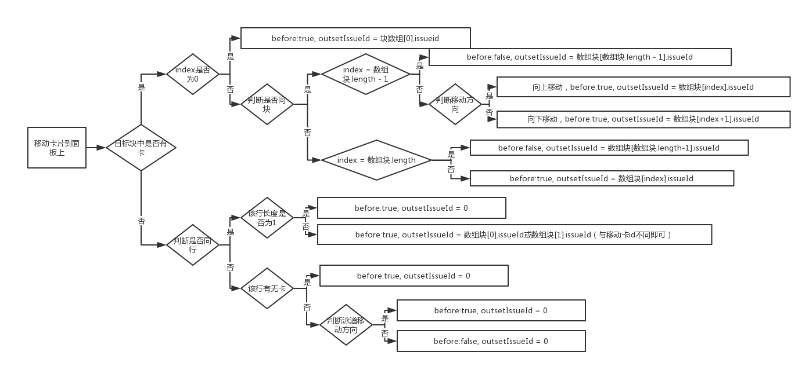
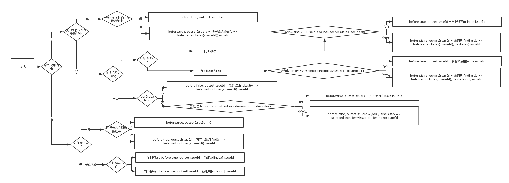

# 关于故事地图复杂拖拽思路备忘

## 问题描述

在问题故事下，可以拖拽卡片，包括面板上的拖拽，backlog侧边栏里的拖拽，两者之间的相互拖拽和多拖支持。

## 单拖（面板）

传给后端的情况为如下四种：

- 情况1：before = true, outsetIssueId = 0 (当向上拖至空的冲刺或版本或其它)
- 情况2：before = true, outsetIssueId = issueId (拖至某个issue前面)
- 情况3：before = false, outsetIssueId = 0 (当向下拖至空的冲刺或版本或其它)
- 情况4：before = false, outsetIssueId = issueId (拖至某个issue后面)

**其中，把卡A拖入BC之间，可以理解为情况2或者情况4，但为了统一处理，全部理解为放在C之前**

拖拽情况复杂，可以考虑找到一个切入点开始寻找，如拖入的块（由水平泳道和垂直列组成的块）中是否有卡片，或是向上拖还是向下拖还是水平拖，但是一定要注意`完备性`，即划分正好覆盖所有情况，不遗漏。（如距离的水平拖动很容易被遗漏）

直接上图：



## 多拖（面板）

多拖主要考虑拖动的卡片数与当前块（或者行）之间的大小关系，判断不同的临界。

上图：



backlog拖动同理，可以理解为是特殊情况，epicId为0。

代码如下，代码为了逻辑的清晰和可修改，没有做进一步的规整，防止后面他人维护时困难。

```
```