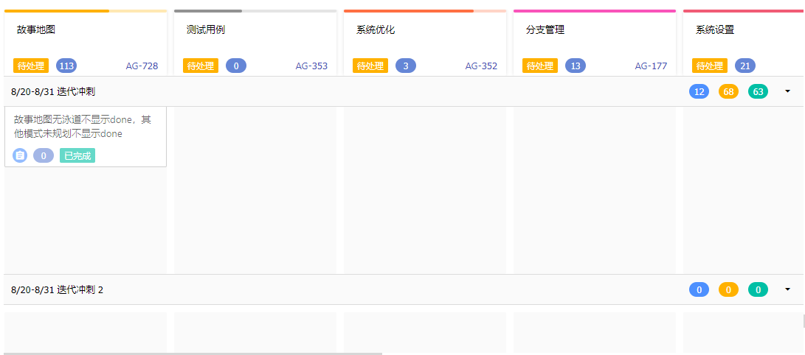
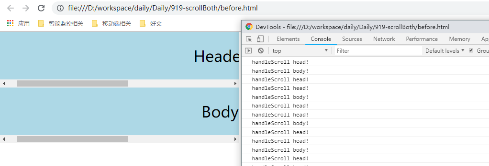
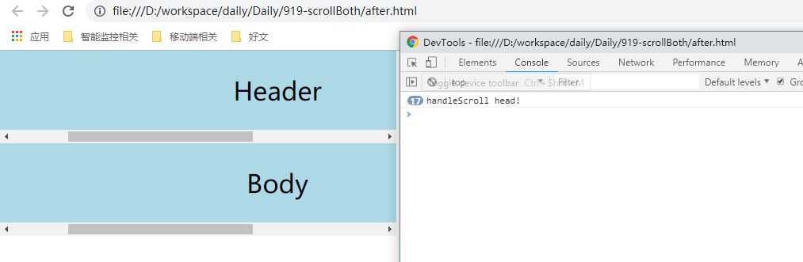

# 两块区域滚动联动

## 问题描述

还是故事地图的需求，要求增加头部滚动时，下部也跟着一起水平滚动。



## 思路

给头部也加scroll监听，滚动时，给body设置scrollLeft即可，so easy！

```
document.getElementById('fixHead-head').addEventListener('scroll', this.handleScrollHead, { passive: true });
document.getElementById('fixHead-body').addEventListener('scroll', this.handleScroll, { passive: true });

...

handleScrollHead = (e) => {
  const { scrollLeft } = e.target;
  const body = document.getElementById('fixHead-body');
  body.scrollLeft = scrollLeft;
}

handleScroll = (e) => {
  const { scrollLeft } = e.target;
  const header = document.getElementById('fixHead-header');
  header.scrollLeft = scrollLeft;
}
```

滚一滚，发现滚动的速度慢的可怕，怎么回事呢，怎么会这么慢。

再仔细一看，scroll事件，不单单在鼠标滚动时触发，在由改变scrollLeft而滚动时也会触发！

意思是，我滚动头部，触发handleScrollHead函数，里面让body跟着滚动，这时候也触发了handleScroll函数，他又去让header跟着滚动，然后，可怕，类似于一种循环调用的感觉。

查资料发现，用`onmousewheel`可以解决，但是项目里不仅有鼠标滚动更有触摸滚动。

换种思路，为什么会重复调用呢？无非是不知道是哪块主动引起的滚动，而onmousewheel就解决了这个问题。

而滚动时，鼠标总是在当前区域内的，如主动滚动header，鼠标肯定在header区域内(滚动轴算在区域内)。

所以有了如下代码

```
let inWhith；

document.getElementById('fixHead-head').addEventListener('scroll', this.handleScrollHead, { passive: true });
document.getElementById('fixHead-body').addEventListener('scroll', this.handleScroll, { passive: true });
document.getElementById('fixHead-head').addEventListener('mouseover', this.handleMouseOverHead);
document.getElementById('fixHead-body').addEventListener('mouseover', this.handleMouseOverBody);
handleMouseOverHead = (e) => {
  window.console.log('in header');
  inWhich = 'header';
}

handleMouseOverBody = (e) => {
  window.console.log('in body');
  inWhich = 'body';
}

handleScrollHead = (e) => {
  if (inWhich === 'body') return;
  const { scrollLeft } = e.target;
  const body = document.getElementById('fixHead-body');
  body.scrollLeft = scrollLeft;
}

handleScroll = (e) => {
  if (inWhich === 'header') return;
  const { scrollLeft } = e.target;
  const header = document.getElementById('fixHead-header');
  header.scrollLeft = scrollLeft;
}
```

表示如果是由头部滚动引发的，此时inWhich为header，而handleScroll事件直接return了。

测试发现满足条件。

可通过控制台查看[优化前](https://github.com/HuangQiii/Daily/blob/master/919-scrollBoth/before.html)和[优化后](https://github.com/HuangQiii/Daily/blob/master/919-scrollBoth/after.html)对比


优化前：



优化后：

