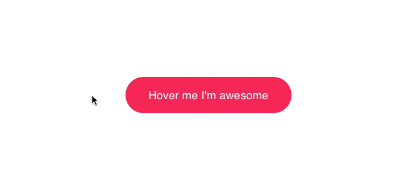

# 使用js改变css中的变量

## 问题回顾

故事地图中的滚动性能，一直是个大问题，在9月1日的滚动记录中就有体现。

当时有个想法是，scrollLeft这个属性，是用来使页面刷新并且让标题们向右运动（margin-left和transform），但是频繁的变化试图对性能的压力很大。

所以寻找了通过js监听滚动事件，直接把scrollLeft写入css达到改变，当时没有找到类似的解决方案，今天看到一个例子，正好是类似方向的。

## 直接上例子

效果图如下：



```
<html>
  <head>
    <style>
      .btn {
        position: relative;
        appearance: none;
        background: #f72359;
        padding: 1em 2em;
        border: none;
        color: white;
        font-size: 1.2em;
        cursor: pointer;
        outline: none;
        overflow: hidden;
        border-radius: 100px;
      }

      span {
        position: relative;
      }

      span::before {
        --size: 0;
        content: '';
        position: absolute;
        left: var(--x);
        top: var(--y);
        width: var(--size);
        height: var(--size);
        background: radial-gradient(circle closest-side, #4405f7, transparent);
        transform: translate(-50%, -50%);
        transition: width .2s ease, height .2s ease;
      }

      span:hover::before {
        --size: 400px;
      }
    </style>
  </head>
  <body>
    <button class="btn">
      <span>hover me and i will change color</span>
    </button>
  </body>
  <script>
    var btn = document.querySelector('.btn');
    btn.onmousemove = (e) => {
      const x = e.pageX - e.target.offsetLeft;
      const y = e.pageY - e.target.offsetTop;
      e.target.style.setProperty('--x', `${x}px`);
      e.target.style.setProperty('--y', `${y}px`);
    }
  </script>
</html>
```

例子是知乎上看到的一个按钮的例子，可以看出，在js里监听onmouseover事件，把鼠标位置写入了css变量，变量直接作用在结点上发生了改变。

完美！立马尝试用到项目上。改造了顶部吸顶标题栏，有效！

这时候带来几个疑问
- 从上文发现，setProperty是绑定在某个具体的结点的style上的，那么改变了这个class，别的应用了这个class的结点样式会如何？

- 能否对一个结点集合，通过class可能获取多个结点，直接使用.style？

### 9月13日更新

对上文留下的两个问题进行了跟踪，发现可以改变父级的变量，使使用了该变量的子元素全都改变。

```
.parent {
  --bgColor: red;
  --left: 0;
}

.child {
  background: var(--bgColor);
  margin-left: var(--left);
}
```

如上，如果改变了parent的变量，所有应用child的都会发生改变。

可以查看[demo](https://github.com/HuangQiii/Daily/blob/master/99-cssValue/demo.html)