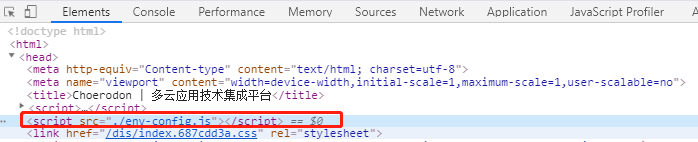

## Choerodon前端环境变量方案

配置React应用程序的方法有很多，在本文中，将向您展示Choerodon平台前端的新环境变量方案，该方案可以实现在运行时配置，所以不需要针对每个环境都进行构建。


### 需求

希望能够将React应用程序使用Docker运行，只构建一次，能够在任何地方运行，并且希望在运行时提供重新配置容器的时机，允许在docker-compose文件内进行变量配置。

例如：

```
version: "3.2"
services:
  my-react-app:
    image: my-react-app
    ports:
      - "3000:80"
    environment:
      - "API_URL=production.example.com"
```

*注：*
在开发中，有两种不同的环境变量。一是在`编译`时已确定的，通过类似config.js的配置文件进行配置；而另一种是在`部署`时（`运行时`）才确定的，比较常见的是根据环境进行区分的一些变量，比如API请求地址前缀，根据部署的环境不同而不同。当前端镜像生成后，需要通过外部去注入这个变量。

### 原来的方案

原来的方案将两种变量混合在一起，导致很难区分到底哪些是可以通过环境变量注入修改的。

代码如下：

```js
// updateWebpackConfig.js
const { apimGateway } = choerodonConfig;

...

if (mode === 'start') {
    defaultEnterPoints = {
      APIM_GATEWAY: apimGateway,
    };
} else if (mode === 'build') {
  if (isChoerodon) {
    defaultEnterPoints = getEnterPointsConfig();
  }
}

const mergedEnterPoints = {
  NODE_ENV: env,
  ...defaultEnterPoints,
  ...enterPoints(mode, env),
};
const defines = Object.keys(mergedEnterPoints).reduce((obj, key) => {
  obj[`process.env.${key}`] = JSON.stringify(process.env[key] || mergedEnterPoints[key]);
  return obj;
}, {});

customizedWebpackConfig.plugins.push(
    new webpack.DefinePlugin(defines),

...

```

```js
// getEnterPointsConfig.js
const enterPoints = {
  APIM_GATEWAY: 'localhost:apimgateway',
};

export default function getEnterPointsConfig() {
  return enterPoints;
}
```

具体步骤为：

当为本地启动（start，development）时:

- 先通过config.js中获取到变量值

- 构造defaultEnterPoints对象，把变量放入

- 然后通过DefinePlugin插件把这个对象的键作为变量注入

为了便于管理，在@choerodon/boot/lib/containers/common/constants中有如下代码：

```js
export const TYPE = `${process.env.TYPE}`;
export const RESOURCES_LEVEL = `${process.env.RESOURCES_LEVEL || ''}`;
export const APIM_GATEWAY = `${process.env.APIM_GATEWAY}`;
export const UI_CONFIGURE = `${process.env.UI_CONFIGURE}`;
export const EMAIL_BLOCK_LIST = `${process.env.EMAIL_BLOCK_LIST}`;
```

在代码中就可以使用了。

当为生产环境（build， product）时:

- 直接使用默认的环境变量及其占位值（这些值是后来替换环境变量的依据）

- 通过structure/enterpoint.sh去执行全局替换

```sh
#!/bin/bash
set -e

find /usr/share/nginx/html -name '*.js' | xargs sed -i "s localhost:8080 $PRO_API_HOST g"
find /usr/share/nginx/html -name '*.html' | xargs sed -i "s localhost:titlename $PRO_TITLE_NAME g"

exec "$@"
```

使用脚本去进行全局搜索，然后进行字符替换。

可见，当为product环境时，只有环境变量才起效（本地设置的值是无效的）。


### 缺点

通过上一章节和示意图的分析，可以发现如下缺点：

1. 增加环境变量是很复杂的：当增加一个环境变量，要修改至少三处地方（enterpoint.sh, contants.js, updateWebpackConfig.js）。如果使用@choerodon/boot的其他项目要加入一个环境变量（这个变量可能只有该项目使用），即使boot（启动器项目，脚手架）没有做任何修改，也必须增加了变量发布一个新版本。

2. 而且从上文可以看出，界定哪些变量是config.js中配置，哪些是环境变量注入是很不明确的（或者说是随@choerodon/boot开发者确定的）

3. 无法明确知道变量是否还在使用。

4. 部署生产环境时，有些变量是必须有环境变量的（一般的逻辑是环境变量覆盖用户变量再覆盖默认值）。

### 新方案

还是使用shell脚本的方式，但这次直接生成js文件，通过window._env_ = {}来注入一个全局的变量，使用时只要通过window._env_yourVarName来获取即可。

具体分为如下几个文件：

- .default.env: 该文件一般是一些初始环境变量的默认值，目前包括一些原有的环境变量，达到平滑升级的效果。

- .env: 用户使用的环境变量文件，用户可以在该文件中以键=值的形式声明环境变量

- env-config.js: 通过运行shell脚本后生成的最终环境变量对象，结构如下：

- env.sh: sh脚本，进行用户环境变量和注入环境变量的合并

```sh
#!/bin/bash

mode=$1

# Recreate config file
rm -rf ./env-config.js
touch ./env-config.js

# Add assignment 
echo "window._env_ = {" >> ./env-config.js

# Read each line in .env file
# Each line represents key=value pairs
while read -r line || [[ -n "$line" ]];
do
  # Split env variables by character `=`
  if printf '%s\n' "$line" | grep -q -e '='; then
    varname=$(printf '%s\n' "$line" | sed -e 's/=.*//')
    varvalue=$(printf '%s\n' "$line" | sed -e 's/^[^=]*=//')
  fi

  # Read value of current variable if exists as Environment variable
  value=$(printf '%s\n' "${!varname}")
  # Otherwise use value from .env file
  [[ -z $value ]] && value=${varvalue}
  
  # Append configuration property to JS file
  echo "  $varname: \"$value\"," >> ./env-config.js
done < .env

while read -r line || [[ -n "$line" ]];
do
  # Split env variables by character `=`
  if printf '%s\n' "$line" | grep -q -e '='; then
    varname=$(printf '%s\n' "$line" | sed -e 's/=.*//')
    varvalue=$(printf '%s\n' "$line" | sed -e 's/^[^=]*=//')
  fi

  # Read value of current variable if exists as Environment variable
  value=$(printf '%s\n' "${!varname}")
  # Otherwise use value from .env file
  [[ -z $value ]] && value=${varvalue}
  
  # Append configuration property to JS file
  echo "  $varname: \"$value\"," >> ./env-config.js
done < .default.env

echo "}" >> ./env-config.js

echo "// ${mode}" >> ./env-config.js
```

步骤解析：

- 创建env-config.js文件

- 写入第一行window._env_={

- 遍历.default.env，如果存在环境变量，则写入键：环境变量值，不存在则写入键：值

- 遍历.env，处理逻辑同上（这里使用了js对象重复声明一个值，后面的会覆盖前面的特性）

- 在文件最后写上}表示结束

### 优化

由于考虑到window平台的开发者，在node内部调用shell脚本可能不会运行，所以用node模拟了一套上述方案，在本地开发和打包时，使用node进行环境变量的合并，当使用环境变量注入时，调用shell脚本进行合并。

### 使用

1. 将@choerodon/boot版本进行升级
2. 在项目根目录下（和package.json同级）创建.env文件（如果没有自定义变量可以不创建）
3. 以键=值的形式写入变量，如

```
SERVER=http://choerodon.com.cn
AUTH_URL=https://api.choerodon.com.cn/oauth/login
```

### 需要解决的问题

#### 开发环境时，通过webpack-dev-server生成的html文件在内存中，那env-config.js写到哪？

通过配置contentBase来加载

```js
// start.js
const serverOptions = {
  quiet: true,
  hot: true,
  ...devServerConfig,
  // contentBase: path.join(process.cwd(), output),
  contentBase: [path.join(__dirname, '../../'), ...],
  historyApiFallback: true,
  host: 'localhost',
};
WebpackDevServer.addDevServerEntrypoints(webpackConfig, serverOptions);
```

#### shell的当前目录相对于命令运行时的目录而不是文件目录

```js
spawn.sync(shellPath, ['development'], { cwd: path.join(__dirname, '../../../'), stdio: 'inherit' });
```

通过指明cwd命令来改变当前文件路径。

### 具体过程

当为本地启动（start，development）时:

- 先在用户根目录下进行查找是否有.env文件

- 如果有.env文件，复制到@choerodon/boot根目录下，与env.sh同级

- 根据shell中的逻辑，合并.default.env和.env的环境变量

- 生成env-config.js到同级目录下，由于该目录被设置为contentBase，所以启动的代码中能够加载到该目录

当为生产环境打包（build，product）时：

- 先在用户根目录下进行查找是否有.env文件

- 如果有.env文件，复制到@choerodon/boot根目录下，与env.sh同级

- 根据shell中的逻辑，合并.default.env和.env的环境变量

- 生成env-config.js到同级目录下

- 复制.env,.default.env,env.shell,env-config.js到dist目录下，与index.html同级

（全部复制是为了应对环境变量注入，也要考虑不注入环境变量的情况，此时env-config.js就是最终的变量）

环境变量替换时

- 通过docker运行shell脚本

- 根据.default.env和.env的键去生成window._env_对象，此时有环境变量则替换为环境变量，无环境变量则使用原来值，生成的env-config.js在同级目录下

### Q&A

#### 哪些变量适合放在这

当采用新的模式后，所有的决定权都在于开发人员（需要慎重），开发人员可以自己声明一个变量，然后在代码中使用，这时当部署生产环境时，可以在.env中声明一个值，然后通过环境变量去覆盖，也可以只是声明这个值（类似于原来的config.js中配置）。

但是总的来说，建议仔细考虑哪些变量是应该作为环境变量注入的。

有两种比较方便的判断方式：

- 当一个前端镜像部署到不同环境时，该变量值是否应该改变，如果是，可能应该作为一个`环境变量`
- 变量是运用在代码打包时的，那么该变量可能是个`非环境变量`

#### 加入了环境变量后不起效

加入了环境变量后，可以在node_modules/@choerodon/boot/env-config.js中查看，自己的环境变量到底有没有被注入，如果被别的库覆盖，可以考虑起个独特的名字或者和他人进行商议（后期会考虑当环境变量重复时，进行警告等检测）。

当部署后，可以通过浏览器直接打开env-config.js文件来查看变量的情况。



#### 原来的环境变量方案会被剔除吗

暂时不会剔除原先的环境变量方案，即还是可以通过costants.js中获取部分环境变量值，但是不排除在今后剔除这种模式。

#### 当环境变量不是字符类型时怎么处理

一般环境变量都是以字符形式注入的，非字符形式可以通过config.js进行处理（如钩子函数等），或者通过序列化来进行处理(JSON.stringfiy).

如上所述，构建时配置将满足大多数场景，既可以自定义增加变量，用自定义的值作为最终指，也可以用环境变量覆盖。
