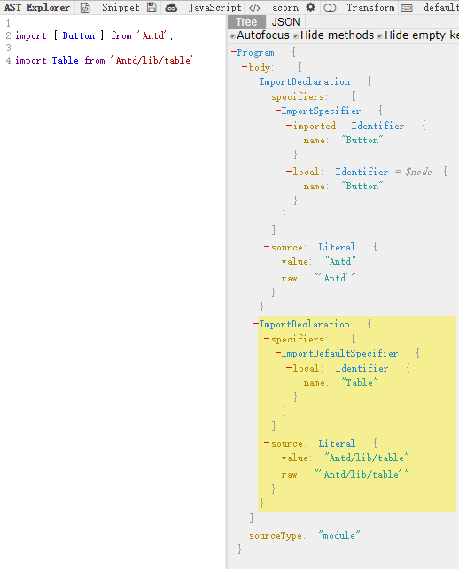
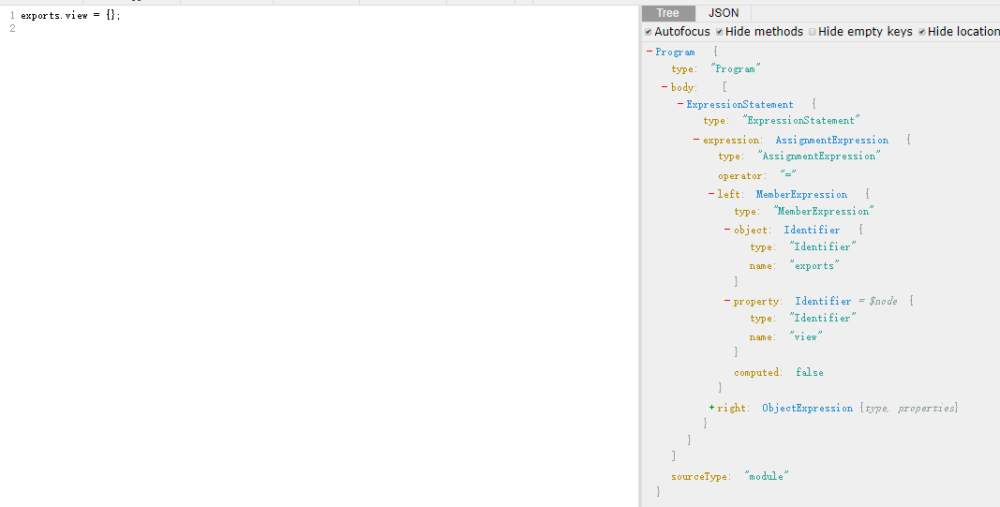
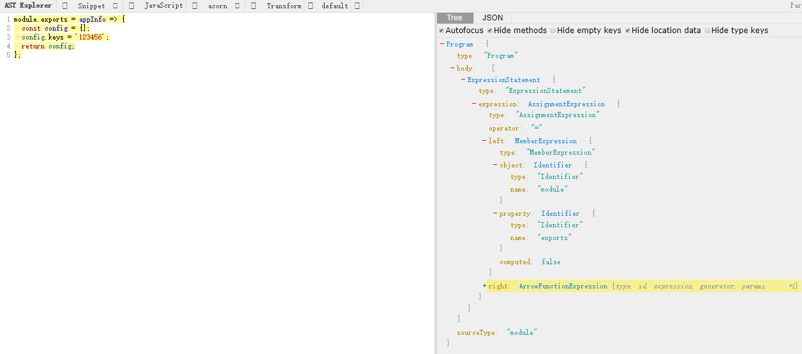
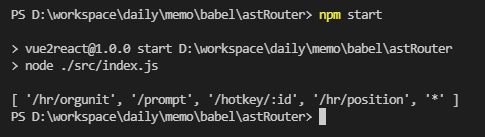

## 编译原理相关学习

起因于看到知乎上的一个[提问](https://www.zhihu.com/question/268622554/answer/384881779)，一想起大学时学的不怎么样的编译原理，又好奇前端怎么用的越来越多AST了，就顺着高赞回答进行一波学习。

正如回答里提到，先从Babel插件开始，看了官方的两个文档

- [Babel手册](https://github.com/jamiebuilds/babel-handbook/blob/master/translations/zh-Hans/user-handbook.md)
- [插件手册](https://github.com/jamiebuilds/babel-handbook/blob/master/translations/zh-Hans/plugin-handbook.md)

前者主要讲用Babel，这个在webpack打包中有所涉及，可以说是现代前端开发必不可少的。

后者主要讲了AST的一些基础，节点操作，API和插件基础。

### 最简单的插件（来自于插件手册的例子）

首先知道Babel插件就是一个function，导出一个对象，这个对象返回一个visitor，然后再里面进行一些操作。

```js
import * as t from "babel-types";

export default function({ types: t }) {
  return {
    visitor: {
      BinaryExpression(path) {
        if (path.node.operator !== '===') {
          return;
        }
        path.node.left = t.identifier('sebmck');
        path.node.right = t.identifier('dork');
      }
    }
  };
}
```

### 类似antd中的按需加载插件（来自于高赞回答中的举例）

Antd中的按需加载插件很有意思，从实现上来看也只是简单的替换。

不过这次通过这个更加深了`代码就是字符串`的理解。

可以通过[该网站](https://astexplorer.net/)查看AST结点情况。



不难看出，ImportDeclaration结点是一样的，都有specifiers（是一个数组）和source，其中source就是from后面的字符串，重点要操作的是specifiers中的ImportSpecifier到ImportDefaultSpecifier。

```js
const types = require('babel-types');

module.exports = {
  visitor: {
    ImportDeclaration(path, ref = {}) {
      const { opts } = ref
      const { node } = path;
      const { specifiers } = node;
      if (opts.library == node.source.value) {
        const newImport = specifiers.map((specifier) => (
          types.importDeclaration(
            [types.ImportDefaultSpecifier(specifier.local)], types.stringLiteral(`${node.source.value}/${specifier.local.name}`),
          )
        ));
        path.replaceWithMultiple(newImport)
      }
    }
  }
}
```

### eslint

静态语法检查也是通过AST来实现的，这里采用回答中相关实践的一个例子来学习一下eslint插件的写法。

通过[官方文档](https://eslint.org/docs/developer-guide/working-with-rules)可以发现大致写法如下：

再看看如下的AST树：

```js
exports.view = {};
module.exports = appInfo => {
  const config = {};
  config.keys = '123456';
  return config;
};
```





可以发现主要区别在left结点下，所以我们从公共结点ExpressionStatement入手，找到里面的expression，获取到left结点，根据里面的object的name是exports还是module来区分。

逻辑代码如下：

```js
ExpressionStatement(node) {
  if (node.expression.type !== 'AssignmentExpression') return;
  const testNode = node.expression.left;
  if (utils.isExports(testNode)) {
    if (hasModule) {
      context.report({ node, messageId: 'overrideExports' });
    }
    hasExports = true;
  } else if (utils.isModule(testNode)) {
    if (hasExports) {
      context.report({ node, messageId: 'overrideExports' });
    }
    if (hasModule) {
      context.report({ node, messageId: 'overrideModule' });
    }
    hasModule = true;
  }
},
```

完整结构见[链接](https://github.com/eggjs/eslint-plugin-eggache/blob/master/lib/rules/no-override-exports.js)

可以发现，这是个很方便的工具，甚至可以衍生出许多类似场景，比如decorate的顺序检查问题等。

### 现学现用

项目中有个需求，根据页面路由扫出所有完整路径，例如从如下代码中：

```jsx
import React, { Component } from 'react';
import CacheRoute, { CacheSwitch } from 'react-router-cache-route';
import asyncRouter from '../src/containers/components/util/asyncRouter';
import { nomatch } from '../src/containers/components';
import createRouteWrapper from '../src/containers/components/util/createRouteWrapper';

const Language = asyncRouter(() => import('./language'));
const OrgUnit = asyncRouter(() => import('./org-unit'));
const Props = asyncRouter(() => import('./yan'));
const HotKey = asyncRouter(() => import('./hotkey'));
const Hk = createRouteWrapper('test/hotkey', HotKey);

export default ({ match }) => (
  <CacheSwitch>
    <CacheRoute exact path={`${match.url}/hr/orgunit`} cacheKey={`${match.url}/hr/orgunit`} component={OrgUnit} />
    <CacheRoute exact path={`${match.url}/prompt`} cacheKey={`${match.url}/sys/prompt`} component={Language} />
    <CacheRoute exact path={`${match.url}/hotkey/:id`} cacheKey={`${match.url}/hotkey/:id`} component={Hk} />
    <CacheRoute exact path={`${match.url}/hr/position`} cacheKey={`${match.url}/hr/position`} component={Props} />
    <CacheRoute path="*" component={nomatch} />
  </CacheSwitch>
);
```

获取`['hr/orgunit', 'prompt', 'hotkey/:id', 'hr/positon']`

于是写下如下代码完成功能：

```js
#!/usr/bin/env node

const fs = require('fs');
const path = require('path');
const babelParse = require('@babel/parser').parse;
const traverse = require('babel-traverse').default;

const code = fs.readFileSync(path.join(process.cwd(), './route.js'), "utf8");

const ast = babelParse(code, {
  sourceType: "module",
  allowImportExportEverywhere: true,
  plugins: [
    'dynamicImport',
    "jsx",
  ],
});

const res = [];

traverse(ast, {
  JSXAttribute(path) {
    if (path.node.name.name === 'path') {
      const pathValue = path.node.value.type !== 'StringLiteral' 
        ? path.node.value.expression.quasis[1].value.raw 
        : path.node.value.value;
      res.push(pathValue);
    }
  }
});

console.log(res);
```

结果如下：



### 强烈推荐阅读的代码和说明

看到不看完放不下系列[this super tiny compiler](https://github.com/jamiebuilds/the-super-tiny-compiler/blob/master/the-super-tiny-compiler.js)

### 参考阅读

- [前端要以正确的姿势学习编译原理（上篇）](https://zhuanlan.zhihu.com/p/36301857)
- [前端对AST（抽象语法树）的应用越来越多，应该看什么书籍才能补充这方面的知识点？](https://www.zhihu.com/question/268622554/answer/384881779)
- [前端工程师可以用编译原理做什么？](https://www.zhihu.com/question/274357154/answer/375520365)
- [the-super-tiny-compiler](前端工程师可以用编译原理做什么？)
- [对 Parser 的误解](http://www.yinwang.org/blog-cn/2015/09/19/parser)
