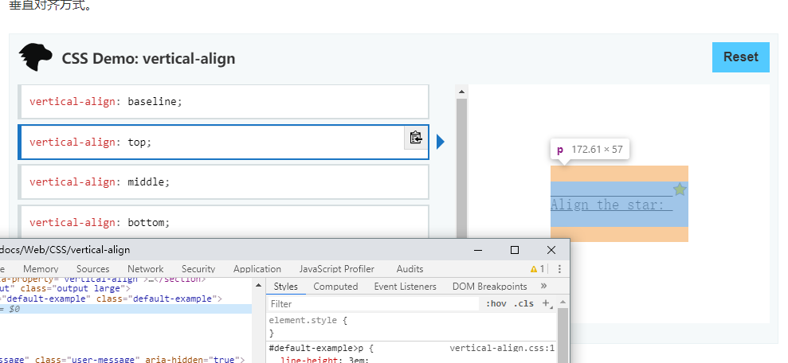

## inline和vertical-align的总结

### 提纲

- 基本概念
- 常见问题
- 解决办法
- 分析总结

### 基本概念

上[MDN](https://developer.mozilla.org/zh-CN/docs/Web/CSS/vertical-align)，权威解答，但是考虑到table使用的变少，只记录一些行内元素的特性。

其中有一点让人一开始容易迷惑，

如果不审查，很容易误解vertical-align: top是图片的底部（baseline默认）对准文字的顶部（text-top），其实是图片的顶部对齐文字块的顶部。

其中还有一点是vertical-align: middle是指

> 使元素的中部与父元素的基线加上父元素x-height（译注：x高度）的一半对齐。

所以middle是受到字体大小的影响的。

### 常见问题

直接贴地址，到时候再自己总结。

[常见问题和解决方法](https://zhuanlan.zhihu.com/p/52441893)