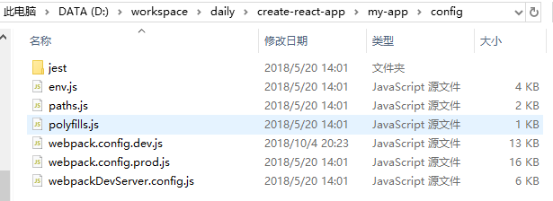
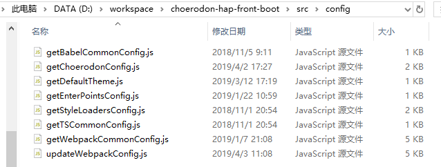

## 从create-react-app和choerodon-boot看前端工程化

### 概念

其实概念本是一个无足轻重的东西，但是能大概阐述清楚一个前端工程化要包括什么：

> 前端工程化是使用软件工程的技术和方法来进行前端项目的开发、维护和管理

那这里就引出了另一个概念，软件工程：

> 应用计算机科学理论和技术以及工程管理原则和方法，按预算和进度，实现满足用户要求的软件产品的定义、开发、和维护的工程或进行研究的学科

### 包含

1. 代码规范: 保证团队所有成员以同样的规范开发代码。
2. 分支管理: 不同的开发人员开发不同的功能或组件，按照统一的流程合并到主干。
3. 模块管理: 一方面，团队引用的模块应该是规范的;另一方面，必须保证这些模块可以正确的加入到最终编译好的包文件中。（以上两点可以总结为模块化或者组件化开发。）
4. 自动化测试：为了保证和并进主干的代码达到质量标准，必须有测试，而且测试应该是自动化的，可以回归的。
5. 构建：主干更新以后，自动将代码编译为最终的目标格式，并且准备好各种静态资源，
6. 部署。 将构建好的代码部署到生产环境。

这么一看，确实有很多东西，但是从前端的角度来看，我个人觉得这里是过多了的，比如分支管理和部署，可能更属于devops和规范的范畴。

我个人认为，前端工程化包括：

1. 约定：稍微看一看源码就会发现，在现在这个项目越来越大的时代，约定 > 规则是一个普遍的趋势，比如React的hooks
2. 模块管理
3. 构建，包括开发时和编译时。

再说的狭义一点，就是用webpack开发出一个能够满足日常开发和生产部署的脚手架项目。

### 从webpack的角度来看

因为现代项目开发一般选用webpack作为打包工具，所以必不可缺的就是webpack的配置文件，那么就从config文件的形式来分析。

#### 形式一，按环境分类的config

例子就是create-react-app创建出来的项目，在config文件夹下就可以看到，有如下的文件结构：

强烈建议阅读两个config，有非常完整的注释，看完基本配置webpack就ok了。

仔细对比不难发现，两个文件（dev和prod）中其实有部分内容是相似甚至相同的，比如module中的部分loader的逻辑，那么另一种组织方式就出现了。

#### 形式二，根据环境来从一个基础配置中做完善并返回完整配置

其中choerodon-front-hap-boot就是采用这种方法。

目录结构大概如下：

从文件的命名上就可以看出，这种形式组织的代码，分离度更高，而且每个文件里的代码量更少，可以更专注地做自己的事情。

比如getWebpackCommonConfig.js返回一份基本的配置，包括对loader的处理和部分通用的plugins的处理。

updateWebpackConfig.js根据环境（development和product）对基本配置进行加工后返回。

在代码里触发webpack的打包过程。

### 自动化测试

从create-react-app中可以看出来，采用了jest作为测试库。
